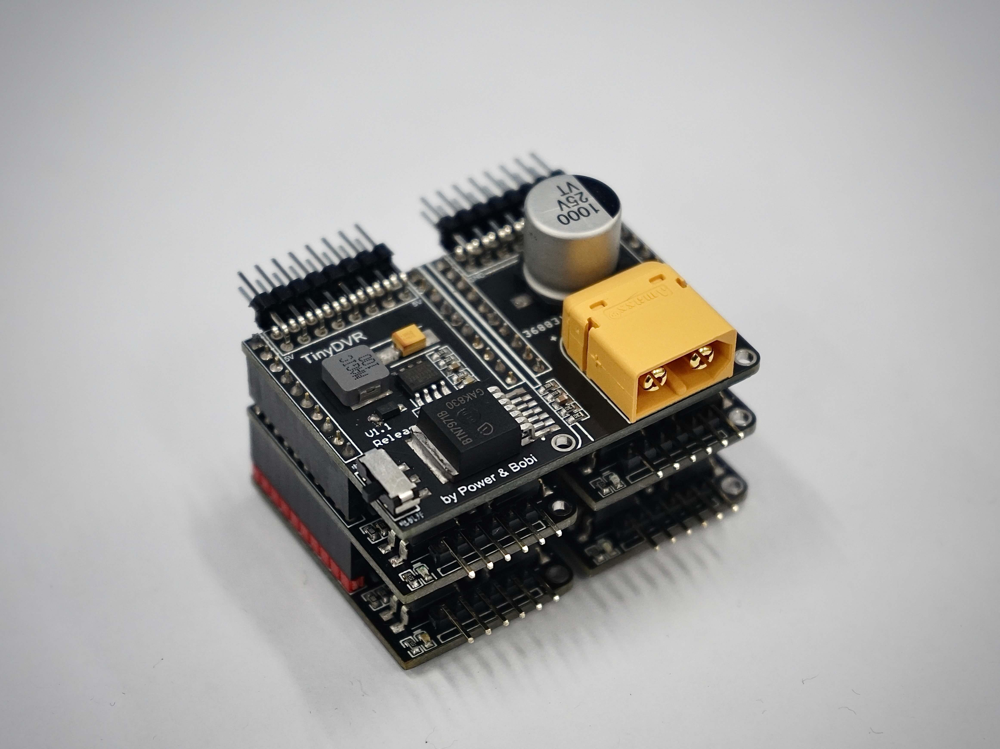

# TinyDVR - 小巧身材，满载动力

TinyDVR 是一款电机驱动套件，包含母板（Master）与子板（Slave），供电部分与驱动部分分离，相比前身 ZenDriver 大幅度缩减了体积，极大提升了可拓展性。你可以根据自己的需要，堆叠不同数量的子板，驱动 n 个电机。

# 基本参数
1. 输入电压：**7.2 ~ 20 V**
2. 输出电流：**0 ~ 68 A**
3. 提供 **5V / 3A** 的电源输出，可供控制器及其他模块使用
4. 保护装置：集成防反接、光耦隔离电路
5. 电机简便接插：对市面上通用的直流减速电机（带编码器），可直接用 6 pin 排线接插（免对线）
5. 可拓展：一块母板可堆叠 n 块子板，实现 n 路电机驱动

# 接口定义

## TinyDVR Master

## TinyDVR Slave

背面引脚详解：
* + ：提供 5V / 3A 的电源输出
* 1 ：IN1 端口，输入 PWM 信号 1
* 2 ：IN2 端口，输入 PWM 信号 2
* A :  编码器 A 相信号端口
* B :  编码器 B 相信号端口
* - ：GND

# 使用指南

## 测试方法

1. 接入 **7.2 ~ 20 V** 电池供电
2. 在对应的子板处接上电机
3. 用 **5V** 供电口分别接 **IN1/ IN2** 端口，此时电机将正 / 反转
## 连接单片机

1. 接入 **7.2 ~ 20 V** 电池供电
2. 在对应的子板处接上电机
3. 共地（驱动板 GND 接单片机 GND）
4. IN1，IN2 端口接单片机对应 PWM 端口（代码内设置）
5. 用代码调试：请见 Github 仓库内的 **测试例程**

